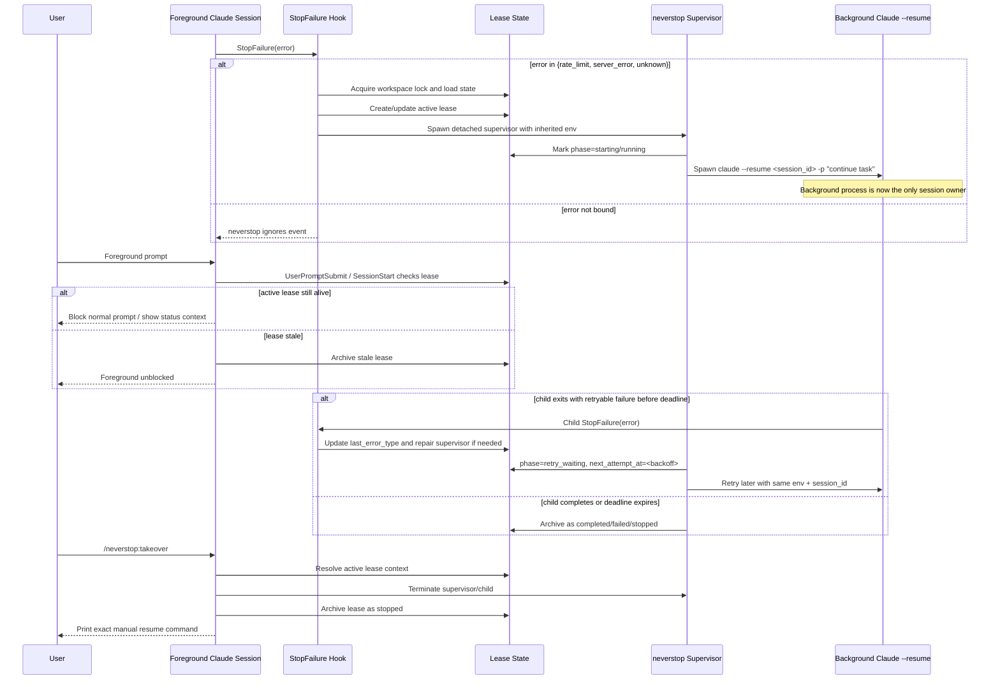

# Neverstop Design

## Overview

`neverstop` is a single Claude Code plugin with two internal responsibilities:

- `respawn`: background recovery after selected `StopFailure` errors
- `exclusive`: foreground mutual exclusion while the background lease is active

The plugin is intentionally a single installable unit because lease state, lock semantics, command namespace, and runtime routing are shared.

## Goals

- keep eligible Claude sessions alive after retryable failures
- avoid foreground/background split-brain on the same workspace
- keep background resume attached to the same config/session namespace as the original Claude process
- make takeover explicit and user-controlled

## Session Ownership Rule

`neverstop` assumes exclusive ownership of a Claude session while its lease is active.

Concretely:

- once the plugin has resumed `session_id` in the background, that session must be treated as occupied
- a second terminal must not attach to the same `session_id` at the same time
- foreground prompts for the same workspace are intentionally blocked while the lease is active

This rule exists because concurrent attachment to the same Claude session produces undefined behavior from the plugin's point of view: duplicate prompt streams, interleaved context, conflicting recovery actions, and impossible-to-audit ownership.

So the plugin's contract is:

1. background owner runs alone
2. foreground is blocked
3. explicit takeover stops the background owner
4. only then may the user manually resume the session

## Runtime Sequence



## Lease Model

All background ownership is represented as a single workspace-scoped `active_lease`.

Important fields:

- `lease_id`
- `session_id`
- `workspace_root`
- `config_dir`
- `env_summary`
- `phase`
- `attempt`
- `retry_deadline_at`
- `next_attempt_at`
- `last_error_type`
- `supervisor`
- `child`

The full parent environment is inherited at runtime, but it is not stored in lease files.

## Active Phases

Foreground prompts are blocked while the lease is in one of:

- `starting`
- `running`
- `retry_waiting`
- `takeover_requested`
- `stopping`

Terminal phases:

- `stopped`
- `failed`
- `completed`

## Hook Behavior

### `StopFailure`

- handles `rate_limit`, `server_error`, and `unknown`
- creates a detached supervisor only when neither the recorded supervisor nor the child is still alive
- stores routing/debug metadata including the resolved config dir
- passes the full parent environment to the supervisor

### `UserPromptSubmit`

- blocks normal prompts while an active lease exists
- always allows `/neverstop:*`
- enforces the single-owner rule so the user cannot casually continue working while the background resume path still owns the session

### `SessionStart`

- injects foreground context explaining the current active lease state

## Background Resume Routing

The effective resume key is:

- `workspace_root`
- `session_id`
- the inherited parent environment

`CLAUDE_CONFIG_DIR` is especially important because it relocates Claude settings, credentials, plugins, and session history. `neverstop` therefore:

- resolves the config dir for status/debugging
- resolves relative `CLAUDE_CONFIG_DIR` values against the workspace root
- shows it in `/neverstop:status`
- keeps the full runtime environment when spawning background work
- falls back to scanning same-workspace state buckets when later hooks or commands arrive without the original config env

## Retry Policy

- immediate first retry
- exponential backoff:
  - `1m`
  - `2m`
  - `4m`
  - `8m`
  - `16m`
  - then capped at `30m`
- total retry window: `6h`

When the window expires, the lease transitions to `failed`.

## StopFailure Binding

The plugin only binds a narrow subset of `StopFailure.error` values.

Bound today:

| StopFailure `error` | Bound | Notes |
| --- | --- | --- |
| `rate_limit` | `✓` | Primary intended case |
| `server_error` | `✓` | Retryable infrastructure/server-side failure |
| `unknown` | `✓` | Catch-all retryable bucket used by the plugin |

Total bound count: `3`.

Any other `StopFailure.error` value is treated as out of scope and does not start the `neverstop` background lease.

## Takeover

`/neverstop:takeover`:

1. marks the active lease as `takeover_requested`
2. terminates the recorded supervisor and child
3. archives the lease as `stopped`
4. tells the user to run:

```bash
CLAUDE_CONFIG_DIR=<recorded-config-dir> claude --resume <session_id>
```

All destructive operations key on `lease_id`, not `session_id`.

The intended operator flow is:

1. inspect with `/neverstop:status`
2. stop ownership with `/neverstop:takeover`
3. manually resume exactly once

The plugin is not designed for "background session keeps running while I also open another terminal on the same session".

## Storage

State root:

```text
${CLAUDE_PLUGIN_DATA}/state/<workspace-slug>-<config-slug>-<workspace+config-hash>/
```

Contents:

- `state.json`
- `leases/<lease-id>.json`
- `leases/<lease-id>.log`
- `lock/`

Writes use atomic temp-file + rename semantics.

## Validation Strategy

1. deterministic automated tests
2. plugin manifest validation
3. simulated `rate_limit` hook-path verification
4. optional real rate-limit reproduction using the default `~/.claude` profile only

## Non-Goals

The plugin does not attempt to:

- auto-attach to a running background process
- auto-refresh the current Claude UI
- auto-run `/exit`
- mutate Claude’s local session store
- support legacy migration from unrelated old plugins
- support concurrent multi-terminal control of the same Claude session
