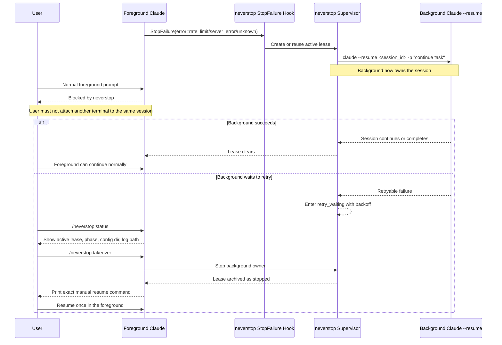

# Neverstop

`neverstop` is a Claude Code plugin that:

- automatically resumes selected failed Claude sessions in the background
- blocks foreground prompts while background recovery still owns the workspace
- preserves the original Claude runtime environment when resuming, including `CLAUDE_CONFIG_DIR`
- can still find the active lease if later hooks or commands are invoked without that same `CLAUDE_CONFIG_DIR`

## What It Does

When Claude Code hits a retryable `StopFailure`:

- `rate_limit`
- `server_error`
- `unknown`

`neverstop` starts a background supervisor that runs:

```bash
claude --resume <session_id> -p "continue task"
```

The resumed background run inherits the full parent environment from the Claude process that triggered the failure.

That matters because Claude Code session recovery depends on both:

- the original workspace
- the original config namespace, especially `CLAUDE_CONFIG_DIR`

## Operational Contract

`neverstop` has an intentional side effect: after a retryable failure, it may keep working on the same Claude session in the background.

That means the plugin is explicitly choosing a single-owner model for a session:

- if `neverstop` is resuming a session in the background, you must treat that session as already attached
- you must not open a second terminal and manually `claude --resume` the same `session_id`
- you must not keep typing normal foreground prompts in another Claude terminal for that same workspace while the background lease is active

This is stricter than the loose mental model some users have for Claude Code session resume. The reason is simple: two terminals driving the same session at once creates split-brain state, conflicting prompts, and ambiguous ownership. `neverstop` is designed to prevent exactly that.

If you want the session back in the foreground, stop the background owner first:

```text
/neverstop:takeover
```

Then resume only with the command that `neverstop` prints.

## Side Effects

When a retryable `StopFailure` happens, `neverstop` may:

- spawn a detached background supervisor process
- run `claude --resume <session_id> -p "continue task"` on your behalf
- block normal foreground prompts for that workspace until the background lease ends or you take over
- keep retrying in the background for up to 6 hours

This behavior is deliberate. The plugin is not passive observability; it is active session ownership and recovery.

## Sequence Diagram

The main operator flow looks like this:



The key rule is unchanged throughout the diagram: while the background lease is active, there is exactly one owner of the session, and it is not the foreground terminal.

## Install

Run Claude with the plugin directory:

```bash
claude --plugin-dir /workspace/skills/cc-neverstop
```

If you want a shell alias:

```bash
alias claude-neverstop='claude --plugin-dir /workspace/skills/cc-neverstop'
```

## Commands

- `/neverstop:status` shows the current lease, config dir, retry phase, and log path
- `/neverstop:takeover` stops the background lease and tells you how to resume manually

Use `/neverstop:takeover` before any manual foreground re-attach. Do not manually resume first and clean up later.

## Retry Behavior

- retryable errors: `rate_limit`, `server_error`, `unknown`
- first retry: immediate
- later retries: exponential backoff up to a 30 minute cap
- total retry window: 6 hours

If the lease is in `retry_waiting`, foreground prompts are still blocked because the background path still owns the workspace.

## StopFailure Coverage

`neverstop` does not intercept every possible failure generically. It only takes over the `StopFailure.error` values that are explicitly bound in the plugin.

Current coverage:

| StopFailure `error` | Handled by `neverstop` | Behavior |
| --- | --- | --- |
| `rate_limit` | `✓` | Start or continue background retry flow |
| `server_error` | `✓` | Start or continue background retry flow |
| `unknown` | `✓` | Start or continue background retry flow |

So the current bound count is `3`.

If Claude Code surfaces any other `StopFailure.error` value, `neverstop` currently ignores it and does not claim background ownership for that failure.

## Environment Inheritance

`neverstop` does not rely on `session_id` alone.

At runtime, it resumes with the original Claude execution context:

- `workspace_root`
- `session_id`
- the full parent environment from the original Claude process

It persists only non-secret routing metadata such as:

- resolved config dir
- a summary of Claude-related env keys that were present

This keeps background resume aligned with the same session history/config namespace without writing secrets into plugin state.

## Development

Validate the plugin:

```bash
claude plugins validate /workspace/skills/cc-neverstop
```

Run tests:

```bash
node --test tests/neverstop.test.mjs
```

## Documentation

- [Design](./DESIGN.md)
- [Architecture](./docs/architecture.md)
- [Validation](./docs/validation.md)
- [Troubleshooting](./docs/troubleshooting.md)
