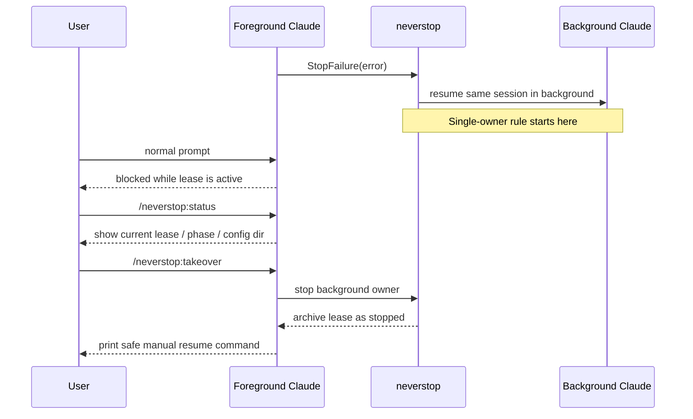

# Neverstop Architecture

`neverstop` is a single Claude Code plugin with two internal concerns:

- `respawn`: recover selected `StopFailure` cases in the background
- `exclusive`: block foreground prompts while the background lease still owns the workspace

## Core model

The plugin treats background work as a single workspace-scoped `active_lease`.

Relevant phases:

- `starting`
- `running`
- `retry_waiting`
- `takeover_requested`
- `stopping`
- `failed`
- `completed`
- `stopped`

Foreground prompts are blocked while the lease is in an active ownership phase.

## Resume routing

Background resume is tied to the original Claude execution context:

- `workspace_root`
- `session_id`
- inherited parent environment

`CLAUDE_CONFIG_DIR` matters because Claude Code stores settings, credentials, plugins, and session history under that config root. `neverstop` therefore:

- inherits the full parent environment at runtime
- persists only non-secret routing/debug metadata
- shows the resolved config dir in `/neverstop:status`
- searches same-workspace state buckets if a later hook or command arrives without the original config env

## Runtime processes

1. Claude triggers `StopFailure`.
2. `hook-stop-failure.mjs` creates or reuses the workspace lease.
3. A detached Node supervisor owns the lease.
4. The supervisor launches `claude --resume <session_id> -p "continue task"` with the inherited parent environment.
5. If the child fails with a retryable error, the supervisor moves the lease into `retry_waiting`.
6. The user can inspect or stop the lease with `/neverstop:status` and `/neverstop:takeover`.

## Operator sequence



## Persistence

State lives under:

```text
${CLAUDE_PLUGIN_DATA}/state/<workspace-slug>-<config-slug>-<workspace+config-hash>/
```

Files:

- `state.json`: current active lease + recent history
- `leases/<lease-id>.json`: per-lease snapshot
- `leases/<lease-id>.log`: supervisor log
- `lock/`: workspace mutation lock

The full parent environment is not persisted.
